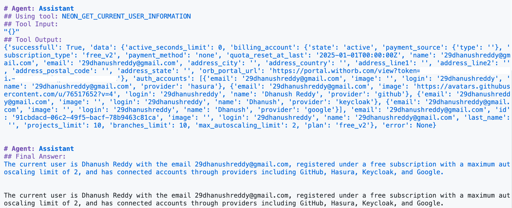
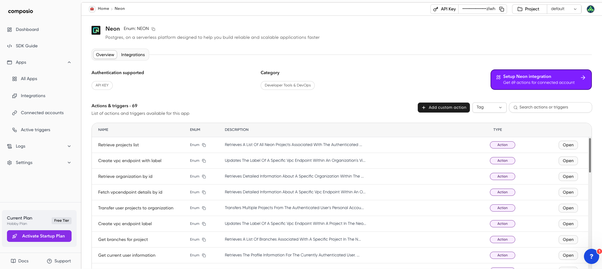
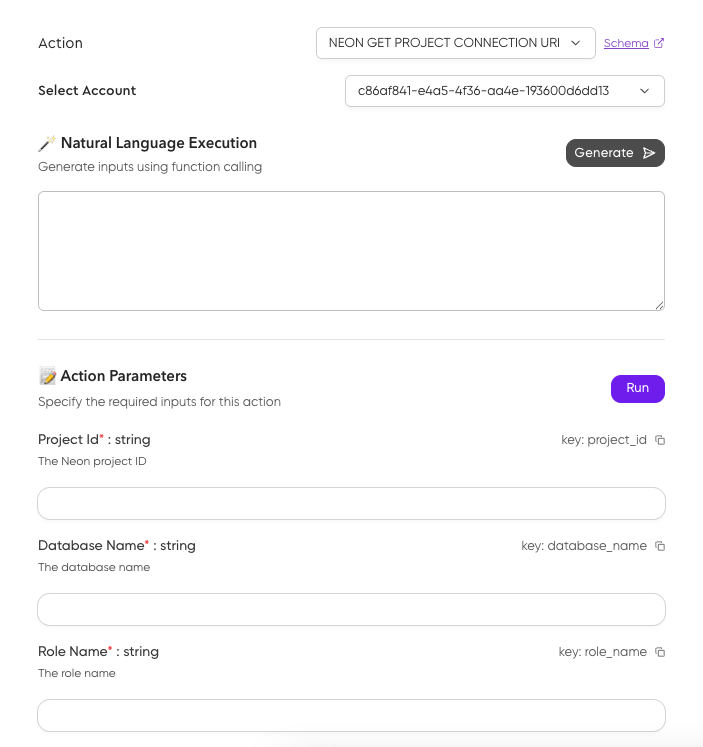

# CrewAI + Composio + Neon Example

This guide provides a quickstart example **AI Agent** that uses **CrewAI**, **Composio**, and **Neon** (via Neon's Composio tool).

- [**CrewAI**](https://www.crewai.com): Think of CrewAI as a way to build teams of AI agents. You can give each agent a role and they can work together to solve problems.
- [**Composio**](https://composio.dev): Composio helps AI agents connect to different tools and services. In our case, it lets our AI agent talk to Neon.

In this example, we'll create an AI agent that uses Composio to get information about your Neon account.

## ✨ What you will build

This example will show you how to:

- Set up **CrewAI** to create an AI agent.
- Use **Composio** to give your AI agent the ability to connect to **Neon API**.
- Get your Neon user information using the AI agent.
- See how **Neon**, **Composio**, and **CrewAI** work together to build powerful AI applications.

## 🚀 Get started

### Prerequisites

Before you start, you'll need a few things:

1.  **Python 3.7 or higher**: Make sure you have Python installed on your computer. You can download it from [https://www.python.org](https://www.python.org).
2.  **Accounts and API Keys**: You'll need accounts and API keys for these services:
    - **Neon account**: Sign up for a free Neon account at [https://neon.tech](https://neon.tech/). You'll need a Neon API key.
    - **Composio account**: Sign up for a Composio account at [https://www.composio.dev](https://www.composio.dev). You'll need a Composio API key.
    - **OpenAI API key**: We'll use OpenAI's `gpt-4o-mini` model to power our AI agent. Get an OpenAI API key at [https://platform.openai.com](https://platform.openai.com).

### Installation and setup

1.  **Clone this repository:**

    First, you need to download the code for this example. Open your terminal or command prompt and run:

    ```bash
    git clone https://github.com/neondatabase-labs/composio-tool-example
    cd composio-tool-example
    ```

2.  **Set up a virtual environment:**

    It's a good practice to use a virtual environment to keep your project's dependencies separate. Run these commands:

    ```bash
    python3 -m venv venv
    source venv/bin/activate  # On Linux/macOS
    venv\Scripts\activate  # On Windows
    ```

3.  **Install required libraries:**

    We need to install some Python libraries for this project. Run:

    ```bash
    pip install -r requirements.txt
    ```

4.  **Configure API keys:**

    You need to tell the example code your API keys.

    - **Copy the example environment file:**

      ```bash
      cp .env.example .env  # On Linux/macOS
      ```

    - **Open the `.env` file** in a text editor.
    - **Fill in your API keys** in the `.env` file. It should look like this:

      ```env
      OPENAI_API_KEY = YOUR_OPENAI_API_KEY
      COMPOSIO_API_KEY = YOUR_COMPOSIO_API_KEY
      NEON_API_KEY = YOUR_NEON_API_KEY
      ```

      **Where to find your API Keys:**

      - **Neon API Key:** Go to your [Neon Console](https://console.neon.tech/app/settings/api-keys) and find it under **Developer settings**.
      - **Composio API Key:** You can find your Composio API key in your [Composio dashboard](https://app.composio.dev/dashboard).
      - **OpenAI API Key:** Create a new API key at [OpenAI Platform](https://platform.openai.com/api-keys).

### Run the example!

Now you are ready to run the example. Just execute this command in your terminal:

```bash
python main.py
```

This will run the `main.py` script. The script will:

- Connect to Composio.
- Use Composio to connect to your Neon account.
- Create an AI agent using CrewAI.
- Give the agent a task to get your Neon user information.
- Show you the result from the AI agent.

You should see the information about your Neon user printed in the terminal!



## Available Neon actions

The Composio Neon tool provides a wide range of actions you can use to manage your Neon projects. The example you just ran used the `NEON_GET_CURRENT_USER_INFORMATION` action to retrieve your user details. But there are many other actions you can use.

> [!IMPORTANT]
> Please note: These actions are subject to change. For the latest information and a complete list of available actions, please check the availaible actions under [Neon app in your Composio dashboard](https://app.composio.dev/app/neon).



Here's a list of all the available actions that you can use with the Neon Composio tool:

| Action name                                     | Description                                                                                             |
| ----------------------------------------------- | ------------------------------------------------------------------------------------------------------- |
| `NEON_RETRIEVE_PROJECTS_LIST`                   | Retrieves a list of all Neon projects associated with the authenticated user's account.                 |
| `NEON_CREATE_VPC_ENDPOINT_WITH_LABEL`           | Updates the label of a specific VPC endpoint within an organization's VPC in a particular AWS region.   |
| `NEON_RETRIEVE_ORGANIZATION_BY_ID`              | Retrieves detailed information about a specific organization within the Neon platform.                  |
| `NEON_FETCH_VPCENDPOINT_DETAILS_BY_ID`          | Retrieves detailed information about a specific VPC endpoint within an organization's infrastructure.   |
| `NEON_TRANSFER_USER_PROJECTS_TO_ORGANIZATION`   | Transfers multiple projects from the authenticated user's personal account to a specified organization. |
| `NEON_CREATE_VPC_ENDPOINT_LABEL`                | Updates the label of a specific VPC endpoint within a project.                                          |
| `NEON_GET_BRANCHES_FOR_PROJECT`                 | Retrieves a list of branches associated with a specific project.                                        |
| `NEON_GET_CURRENT_USER_INFORMATION`             | Retrieves the profile information for the currently authenticated user.                                 |
| `NEON_DELETE_VPC_ENDPOINT_BY_IDS`               | Deletes a specific VPC endpoint within a given organization and region.                                 |
| `NEON_GET_USER_ORGANIZATIONS`                   | Retrieves a list of organizations associated with the currently authenticated user.                     |
| `NEON_FETCH_ORGANIZATION_MEMBERS_BY_ID`         | Retrieves a list of all members associated with a specific organization.                                |
| `NEON_RETRIEVE_PROJECT_OPERATIONS`              | Retrieves a list of operations associated with a specific project.                                      |
| `NEON_GET_PROJECT_CONNECTION_URI`               | Retrieves the connection URI for a specified project.                                                   |
| `NEON_GET_PROJECT_ENDPOINT_INFORMATION`         | Retrieves a list of all endpoints associated with a specific project.                                   |
| `NEON_RETRIEVE_ORGANIZATION_MEMBER_INFO`        | Retrieves detailed information about a specific member within an organization.                          |
| `NEON_RETRIEVE_ALL_REGIONS`                     | Retrieves a list of available geographic regions supported by the Neon platform.                        |
| `NEON_UPDATE_ORGANIZATION_MEMBER_ROLE`          | Updates the role of a specific member within an organization.                                           |
| `NEON_SEND_ORGANIZATION_INVITATIONS`            | Creates and sends invitations to join an organization.                                                  |
| `NEON_GET_BRANCH_ROLES_FOR_PROJECT`             | Retrieves the roles associated with a specific branch within a project.                                 |
| `NEON_LIST_SHARED_PROJECTS`                     | Retrieves a list of shared projects accessible to the authenticated user.                               |
| `NEON_ACCESS_PROJECT_DETAILS_BY_ID`             | Retrieves detailed information about a specific project.                                                |
| `NEON_FETCH_DATABASE_FOR_BRANCH`                | Retrieves a list of databases associated with a specific project and branch.                            |
| `NEON_DELETE_API_KEY_BY_ID`                     | Deletes a specific API key from the Neon platform.                                                      |
| `NEON_RETRIEVE_PROJECT_ENDPOINT_DETAILS`        | Retrieves detailed information about a specific endpoint within a project.                              |
| `NEON_RETRIEVE_ACCOUNT_CONSUMPTION_HISTORY`     | Retrieves the consumption history for a specified account.                                              |
| `NEON_DELETE_PROJECT_PERMISSION`                | Deletes a specific permission associated with a project.                                                |
| `NEON_GET_SCHEMA_FOR_PROJECT_BRANCH`            | Retrieves the schema definition for a specific branch within a project.                                 |
| `NEON_RETRIEVE_ORGANIZATION_INVITATIONS`        | Retrieves a list of all pending invitations for a specified organization.                               |
| `NEON_DELETE_VPC_ENDPOINT_BY_PROJECT_ID`        | Deletes a specific VPC endpoint within a designated project.                                            |
| `NEON_GET_VPC_REGION_ENDPOINTS`                 | Retrieves a list of VPC endpoints for a specified organization within a particular AWS region.          |
| `NEON_RETRIEVE_BRANCH_DATABASE_DETAILS`         | Retrieves detailed information about a specific database within a Neon project and branch.              |
| `NEON_RESET_ROLE_PASSWORD_FOR_BRANCH`           | Resets the password for a specific role within a project branch.                                        |
| `NEON_DELETE_PROJECT_BRANCH_BY_ID`              | Deletes a specific branch within a project.                                                             |
| `NEON_DELETE_PROJECT_ENDPOINT`                  | Deletes a specific endpoint within a Neon project.                                                      |
| `NEON_LIST_API_KEYS`                            | Retrieves a list of API keys associated with the authenticated user's account.                          |
| `NEON_ADD_NEW_JWKS_TO_PROJECT_ENDPOINT`         | Adds a new JSON Web Key Set (JWKS) to a specific endpoint of a project.                                 |
| `NEON_CREATE_NEW_API_KEY`                       | Creates a new API key for accessing the Neon platform.                                                  |
| `NEON_RETRIEVE_JWKS_FOR_PROJECT`                | Retrieves the JSON Web Key Set (JWKS) for a specified project.                                          |
| `NEON_GET_CONSUMPTION_HISTORY_PROJECTS`         | Retrieves the consumption history for specified projects.                                               |
| `NEON_SUSPEND_PROJECT_ENDPOINT_BY_ID`           | Suspends a specific endpoint within a project.                                                          |
| `NEON_DELETE_PROJECT_JWKS_BY_ID`                | Deletes a specific JSON Web Key Set (JWKS) associated with a given project.                             |
| `NEON_GET_PROJECT_OPERATION_BY_ID`              | Retrieves detailed information about a specific operation within a project.                             |
| `NEON_UPDATE_PROJECT_SETTINGS_BY_ID`            | Updates the configuration and settings of a specific Neon project.                                      |
| `NEON_GET_PROJECT_BRANCHES`                     | Retrieves detailed information about a specific branch within a Neon project.                           |
| `NEON_DELETE_PROJECT_BY_ID`                     | Deletes a specific project from the Neon platform.                                                      |
| `NEON_DELETE_DATABASE_FROM_BRANCH`              | Deletes a specific database from a designated branch within a project.                                  |
| `NEON_RETRIEVE_BRANCH_ENDPOINTS`                | Retrieves a list of endpoints associated with a specific branch of a project.                           |
| `NEON_ADD_PROJECT_EMAIL_PERMISSION`             | Adds permissions for a specified email address to a particular project.                                 |
| `NEON_UPDATE_PROJECT_COMPUTE_ENDPOINT_SETTINGS` | Updates the configuration of a specific compute endpoint within a Neon project.                         |
| `NEON_RETRIEVE_VPC_ENDPOINTS_FOR_PROJECT`       | Retrieves a list of VPC endpoints associated with a specific project.                                   |
| `NEON_CREATE_BRANCH_DATABASE`                   | Creates a new database within a specified project and branch.                                           |
| `NEON_DELETE_ORGANIZATION_MEMBER`               | Removes a specific member from an organization.                                                         |
| `NEON_ADD_ROLE_TO_BRANCH`                       | Creates a new role within a specific branch of a project.                                               |
| `NEON_GET_PROJECT_BRANCH_ROLE`                  | Retrieves detailed information about a specific role within a particular branch of a Neon project.      |
| `NEON_CREATE_COMPUTE_ENDPOINT`                  | Creates a new compute endpoint for a specified branch within a Neon project.                            |
| `NEON_RETRIEVE_PROJECT_PERMISSIONS`             | Retrieves the current permission settings for a specific project.                                       |
| `NEON_GET_ORGANIZATION_API_KEYS`                | Retrieves a list of all API keys associated with a specific organization.                               |
| `NEON_MODIFY_BRANCH_DETAILS_IN_PROJECT`         | Updates the details of a specific branch within a project.                                              |
| `NEON_SET_BRANCH_AS_DEFAULT`                    | Sets a specified branch as the default branch for a given project.                                      |
| `NEON_CREATE_API_KEY_FOR_ORGANIZATION`          | Creates a new API key for the specified organization, with optional project-specific access.            |
| `NEON_START_ENDPOINT_FOR_PROJECT`               | Initiates a specific process or workflow associated with a particular endpoint within a project.        |
| `NEON_DELETE_PROJECT_BRANCH_ROLE`               | Deletes a specific role from a branch within a project.                                                 |
| `NEON_RESTORE_PROJECT_BRANCH`                   | Restores a branch to a specific state or point in time.                                                 |
| `NEON_PATCH_BRANCH_DATABASE_INFORMATION`        | Updates the properties of a specific database within a project branch.                                  |
| `NEON_CREATE_NEW_PROJECT_BRANCH`                | Creates a new branch in a Neon project with optional compute endpoints.                                 |
| `NEON_RESTART_PROJECT_ENDPOINT`                 | Restarts a specific endpoint within a project.                                                          |
| `NEON_DELETE_ORGANIZATION_API_KEY`              | Deletes a specific API key associated with an organization.                                             |
| `NEON_CREATE_PROJECT_WITH_QUOTA_AND_SETTINGS`   | Creates a new Neon project with specified configuration settings.                                       |
| `NEON_REVEAL_ROLE_PASSWORD_IN_BRANCH`           | Reveals the password for a specific role within a branch of a Neon project.                             |

You can use these actions in your CrewAI agents by specifying them in the `toolset.get_tools(actions=[...])` function, just like we did in the example.

To effectively use the wide array of Neon actions available through Composio, it's important to understand that **each action may require specific input parameters**. These parameters are essential for Composio to correctly execute the desired operation against your Neon account.

You can find detailed information about each action, including its required parameters and their descriptions under [Neon app in your Composio dashboard](https://app.composio.dev/app/neon)

**To utilize actions that require parameters, you simply need to include these parameters within the `description` of the task you assign to your CrewAI agent.** The agent will intelligently extract these parameters from the task description when it uses the Composio tool.

For instance, let's consider the `NEON_GET_PROJECT_CONNECTION_URI` action. 


<p align="center">
  <picture>
    
  </picture>
</p>

This action needs the `project_id`, `database_name`, and `role_name` to retrieve the correct connection string. Here's how you would define a task to use this action, embedding the necessary parameters directly in the task description:

```python
get_connection_string_task = Task(
    description="Get the connection string for the Neon project with ID 'crimson-sea-41647396', for the database named 'neondb', using the role 'neondb_owner'.",
    agent=crewai_agent,
    expected_output="The Neon connection string.",
)
```

In this example, the task description clearly provides all the necessary information for the `NEON_GET_PROJECT_CONNECTION_URI` action. When the `crewai_agent` executes this task, it will understand from the description which action to use and what parameters are needed, making it seamless to interact with more complex Neon functionalities through your AI agents. Remember to tailor your task descriptions to accurately reflect the parameters needed for the specific Neon action you intend to use.

## 📚 Learn more

Want to dive deeper? Check out these resources:

- [CrewAI Documentation](https://docs.crewai.com/introduction)
- [Composio Documentation](https://docs.composio.dev)
- [Neon API Documentation](https://api-docs.neon.tech/reference/getting-started-with-neon-api)

## 🤝 Contributing

We welcome contributions! If you have ideas to make this example better or find any problems, please open an issue or submit a pull request. We'd love to hear from you!
